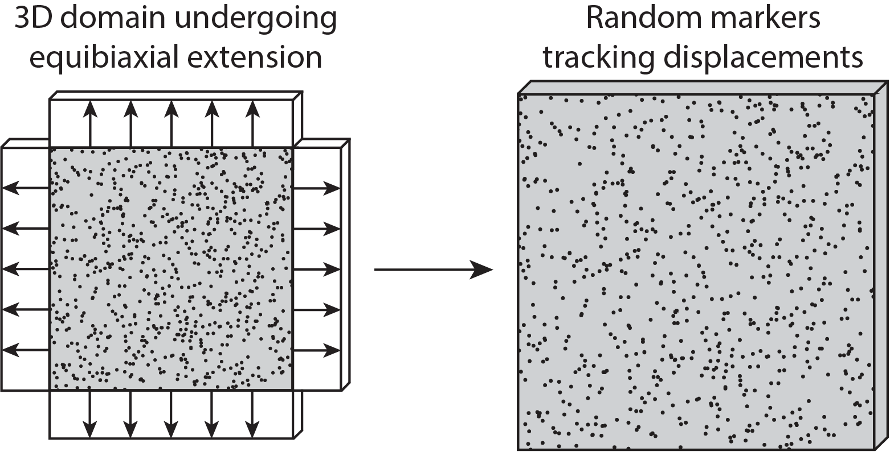
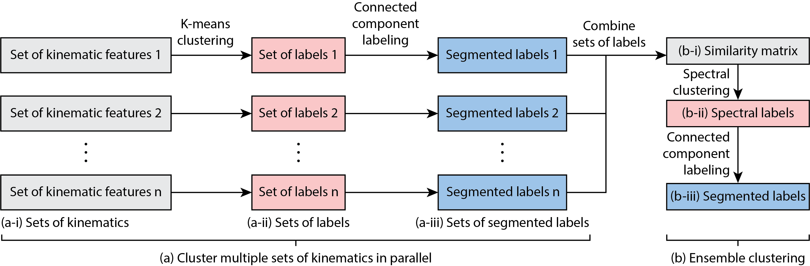
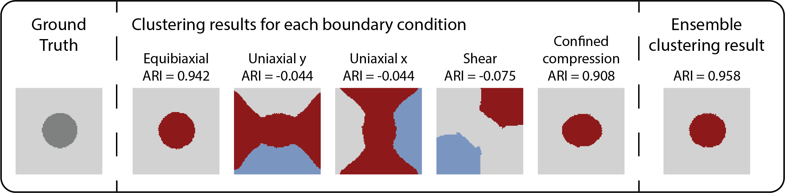

# Cluster project

[](https://www.python.org/)

[](https://github.com/sandialabs/sibl#license)

[](https://github.com/quan4444/cluster_project/actions)
[](https://codecov.io/gh/quan4444/cluster_project)

## Table of contents

* [Project Background and Summary](#summary)
* [Project Pipeline](#pipeline)
* [Tutorials: Identifying sub-domains within a heterogeneous domain](#tutorial1)
* [Tutorials: Clustering a homogeneous domain into self-similar sub-domains for sensor placement](#tutorial2)

## Project Background and Summary <a name="summary"></a>

The goal of this project is to cluster a domain into several sub-domains using the mechanical and positional information available. Broadly speaking, a domain can represent many physical world objects, such as a sample of soft tissue or soft robot. We developed a clustering pipeline with 2 main applications in mind:
- Clustering a heterogeneous soft tissue into mechanically homogeneous sub-domains.
- Clustering a homogeneous domain representing a soft robot into self-similar sub-domains (i.e., the strain values within a sub-domain are similar) for sensor placement.
Before explaining the full pipeline, we will introduce some concepts as background. Readers familiar with continuum mechanics and unsupervised machine learning can skip the rest of this section.

To learn more details about this project, please check out our full paper here. (link)

### Markers on Domain

In this project, we have a 3D domain with size $1\times1\times0.05$. As we perform mechanical extensions (e.g., equibiaxial extension, uniaxial extension) on the domain, we can track its movements with randomly sampled markers at the surface of the domain. In many applications, we can use digital markers (e.g., key points, corner points) or physical markers (e.g., hair follicles, skin pores, speckle patterns) to track the deformations of the objects.

<p align = "center">


### Kinematics

Briefly, [Kinematics](https://en.wikipedia.org/wiki/Kinematics) is a field of study describing the motion of objects. In this project, we will use the following kinematics (from [continuum mechanics](http://www.continuummechanics.org/)): displacement $u$, displacement gradient $\nabla u$, deformation gradient $F$, right Cauchy-Green strain tensor $C$, left Cauchy-Green strain tensor $b$, Green-Lagrange strain tensor $E$, and invariants $I$. 

Here, we will explain the definitions and provide some intuition for the kinematics. [Displacement](https://docs.google.com/document/d/10wbmaAmNHrgy0o94kQ6T_tqtWfaZ9LxQLCmytoHcUHo/edit) is a vector whose length is the shortest distance between the initial and final position of an object. Given the displacement and location of an object, we can derive the [material displacement gradient](https://en.wikipedia.org/wiki/Deformation_(physics)#Displacement_gradient_tensor) as the partial differentiation of the displacement vector with respect to the material coordinates. Next, we can use the displacement gradient to study deformation, which represents the change in size and shape of a continuum body. The [deformation gradient](https://en.wikipedia.org/wiki/Deformation_(physics)) is the fundamental kinematic for deformation, and it characterizes the changes of material elements during motion. Other important kinematics are strain tensors. Unlike displacement, which is a directly measurable quantity, strain tensors are concepts created for the purpose of analysis. Hence, there are many different [strain tensors](https://en.wikipedia.org/wiki/Finite_strain_theory#Deformation_tensors) found in the literature. Given the deformation gradient $F$, we can compute the the right Cauchy-Green strain tensor as $C=F^TF$, the left Cauchy-Green strain tensor as $b=FF^T$, and the Green-Lagrange strain tensor as $E=(F^TF-I)$, where $I$ is the identity matrix. Finally, for any tensors, we can compute the [invariants](https://en.wikipedia.org/wiki/Invariants_of_tensors). Intuitively, invariants of a tensor are frame-indifference quantities, which means the quantities do not depend on the change of observer. Since the material behaviors of a continuum body should remain independent of observers, invariants are crucial for capturing these material behaviors. For an in-depth explaination of kinematics and continuum mechanics, please check out the [Nonlinear Solid Mechanics textbook](https://www.wiley.com/en-us/Nonlinear+Solid+Mechanics:+A+Continuum+Approach+for+Engineering-p-9780471823193).

### Unsupervised Learning/Clustering

In machine learning, [unsupervised learning](https://en.wikipedia.org/wiki/Unsupervised_learning) methods try to identify patterns within the data given no labels. Here, we use 2 common methods: [K-means Clustering](https://en.wikipedia.org/wiki/K-means_clustering), and [Spectral Clustering](https://en.wikipedia.org/wiki/Spectral_clustering). Both methods split a set of data points into clusters with similar behaviors. Due to the lack of labels, unsupervised learning methods cannot utilize more accepted error metrics (e.g., mean squared error), which would require labels or a ground truth. This has led to the development of [clustering performance evaluation metrics](https://scikit-learn.org/stable/modules/clustering.html#clustering-performance-evaluation) to try and assess the performance of the methods.

### Ensemble Clustering

In many applications, we cannot determine the correctness of our unsupervised learning methods. However, we might be able to obtain different clustering results via different methods or via different scenarios, then we aggregate the different clustering results to retrieve the final consensus clustering result using [Ensemble Clustering](https://en.wikipedia.org/wiki/Consensus_clustering).

## Project Pipeline <a name="pipeline"></a>

The general pipeline is as follow:

`Select a domain with a corresponding heterogeneous pattern` $\mapsto$ `Select constitutive model(s)` $\mapsto$ `Select boundary condition(s)` $\mapsto\$ `Generate 1 set of displacement markers per boundary condition` $\mapsto$ `Calculate kinematics features for each set of markers` $\mapsto$ `Clustering pipeline`

The following section will describe the details for our clustering pipeline

#### Clustering pipeline

From `Calculate kinematics features for each set of markers`, we will obtain the sets of kinematics for different boundary conditions. Then, we can follow our clustering pipeline to identify the sub-domains:

<p align = "center">


## Tutorials: Identifying sub-domains within a heterogeneous domain <a name="tutorial1"></a>

This GitHub repository contains a folder called ``tutorials`` that contains two examples, one for running the clustering pipeline on the heterogeneous samples to identify the different material sub-domains, and one for running the clustering pipeline on the homogeneous sample for sensor placement. For starter, we will identify the sub-domains for a heterogeneous domain. To run the tutorials, change your current working directory to the ``tutorials`` folder. The outputs of the tutorials are stored inside the folders in ``tutorials/files/example_data/`` with names ending in ``'_results'``. The details of the outputs are discussed below.

### Preparing data for analysis

The data will be contained in the ``tutorials/files/example_data/`` folder. Critically:
1. The files must have a ``'.npy'`` extension.
2. The files with name starting with ``'pt_'`` must contain the 2D or 3D locations of the markers.
3. The files with the name starting with ``'disp_'`` must contain the 2D or 3D displacements of the markers, corresponding to the ``'pt_'`` files.

Here is how the folders will be structured:
```bash
|___ tutorials
|	___ files
|		|___ example_data
|			|___ circle_inclusion_NH
|				|___ 'pt_example1.npy'
|				|___ 'disp_example1.npy'
```

Here, we will import the necessary packages. We will select the files for random markers locations as ``pt_loc_files``, and the files for the corresponding displacements as ``u_mat_files``. Each pair of ``pt_loc_files`` and ``u_mat_files`` contains the information for a set of boundary condition constraints. After selecting the files, we will use the function ``load_multiple`` to load all random markers locations into ``pt_loc_all`` and all displacements into ``u_mat_all``. ``pt_loc_all`` and ``u_mat_all`` are m by n by dim arrays, where m is the number of boundary conditions, n the number of random markers, and dim the dimension of the data. The imported files below contains the information for a heterogeneous sample depicting a circular inclusion with a neo-Hookean constitutive model.

```python3
import numpy as np
from cluster_project import kinematics as kn
from cluster_project import cluster, plotting

# user inputs for size of sample
length_samp = 1

# load markers positions and displacements
disp_path = 'files/example_data/circle_inclusion_NH'
pt_loc_files = np.array(['pt_sssc_equi_disp0.4.npy','pt_sssc_uni_y_disp0.4.npy',\
                        'pt_sssc_uni_x_disp0.4.npy','pt_sssc_shear_0.4.npy',\
                        'pt_sssc_comp_0.2.npy'])
u_mat_files = np.array(['disp_sssc_equi_disp0.4.npy','disp_sssc_uni_y_disp0.4.npy',\
						'disp_sssc_uni_x_disp0.4.npy','disp_sssc_shear_0.4.npy',\
						'disp_sssc_comp_0.2.npy'])
pt_loc_all,u_mat_all = kn.load_multiple(disp_path,pt_loc_files,u_mat_files)
disp_type = np.array(['equibiaxial','uniaxial y','uniaxial x','shear','confined compression'])
domain_type = 'circle_inclusion' # necessary for obtaining ground truth / ARI
```

Finally, we can determine the number of markers in ``pt_len`` and sample grid markers with the function ``sample_points``. The function will automatically round ``pt_len`` down to the nearest perfect square, providing us a squared grid markers (e.g., 8000 markers will be rounded down to 7921 markers).

```python3
# generate grid markers
pt_len = 8000
points_sel = kn.sample_points(pt_len,L=length_samp)
```

### Current core functionality

In this tutorial, there are 2 core functionalities available.

#### Kinematics calculations

The function ``get_kinematics_with_nn`` will take in the sets of random markers ``pt_loc_all``, the corresponding displacements ``u_mat_all``, the grid markers ``points_sel``, and the number of neighbors ``num_neigh``, and *generate multiple sets of kinematics* (e.g., strain $E$ as ``strain_list``, deformation gradient $F$ as ``F_list``) for the corresponding grid markers ``points_sel``. Here, ``num_neigh`` is the number of nearest neighbor used to interpolate the displacement gradients for the grid markers. The output of the code contains multiple arrays of kinematics, each with shape of m by n by dim, where m is the number of boundary conditions, n the number of markers, and dim the dimensions of the kinematics. The detail of the kinematics is as follow:
- ``u_mat_list``: the displacements $u$ of the grid markers with shape of m by n by dim, where ``dim=2`` and ``u_mat_list[:,:,0]`` is the displacements in x, and ``u_mat_list[:,:,1]`` the displacements in y.
- ``grad_u_list``: the gradient of the displacements $\nabla u$ of the grid markers with shape of m by n by dim, where ``dim=4``. $\nabla u_{11}$, $\nabla u_{22}$, $\nabla u_{12}$, and $\nabla u_{21}$ correspond to ``grad_u_list[:,:,0]``,``grad_u_list[:,:,1]``, ``grad_u_list[:,:,2]``, and ``grad_u_list[:,:,3]``, respectively.
- ``strain_list``: the strain $E$ of the grid markers with shape of m by n by dim, where ``dim=4``. $E_{11}$, $E_{22}$, $E_{12}$, and $E_{21}$ correspond to ``strain_list[:,:,0]``,``strain_list[:,:,1]``, ``strain_list[:,:,2]``, and ``strain_list[:,:,3]``, respectively.
- ``I_strain_list``: the invariants of strain of the grid markers with shape of m by n by dim, where ``dim=2``. The first invariant $I_{1}$ and second invariant $I_{2}$ of strain correspond to ``I_strain_list[:,:,0]``, and ``I_strain_list[:,:,2]``, respectively.
- ``F_list``: the deformation gradient $F$ of the grid markers with shape of m by n by dim, where ``dim=4``. $F_{11}$, $F_{22}$, $F_{12}$, and $F_{21}$ correspond to ``F_list[:,:,0]``,``F_list[:,:,1]``, ``F_list[:,:,2]``, and ``F_list[:,:,3]``, respectively.
- ``I_F_list``: the invariants of the deformation gradient of the grid markers with shape of m by n by dim, where ``dim=2``. The first invariant and second invariant of the deformation gradient correspond to ``I_F_list[:,:,0]``, and ``I_F_list[:,:,2]``, respectively.
- ``C_list``: the right Cauchy-Green $C$ of the grid markers with shape of m by n by dim, where ``dim=4``. $C_{11}$, $C_{22}$, $C_{12}$, and $C_{21}$ correspond to ``C_list[:,:,0]``,``C_list[:,:,1]``, ``C_list[:,:,2]``, and ``C_list[:,:,3]``, respectively.
- ``I_C_list``: the invariants of the right Cauchy-Green of the grid markers with shape of m by n by dim, where ``dim=2``. The first invariant and second invariant of the right Cauchy-Green correspond to ``I_C_list[:,:,0]``, and ``I_C_list[:,:,2]``, respectively.
- ``b_list``: the left Cauchy-Green $b$ of the grid markers with shape of m by n by dim, where ``dim=4``. $b_{11}$, $b_{22}$, $b_{12}$, and $b_{21}$ correspond to ``b_list[:,:,0]``,``b_list[:,:,1]``, ``b_list[:,:,2]``, and ``b_list[:,:,3]``, respectively.
- ``I_b_list``: the invariants of the left Cauchy-Green of the grid markers with shape of m by n by dim, where ``dim=2``. The first invariant and second invariant of the left Cauchy-Green correspond to ``I_b_list[:,:,0]``, and ``I_b_list[:,:,2]``, respectively.

```python3
# obtain kinematics at grid markers for each file
num_neigh=40

u_mat_list,grad_u_list,strain_list,I_strain_list,F_list,I_F_list,C_list,I_C_list,b_list,I_b_list = kn.get_kinematics_multiple(pt_loc_all,u_mat_all,points_sel,num_neigh)
```

#### Clustering the domain

First, we select the feature we want to use for clustering (e.g., ``features_all = I_C_list``). The function ``cluster_full_pipelines`` will take in ``features_all``, the number of clusters ``k``, and the grid markers ``points_sel``, and will output the clustering results and other variables useful for analysis, which will be discussed below. The outputs for this tutorial are stored in ``tutorials/files/example_data/circle_inclusion_NH_results``.
- ``cluster_results``: the clustering results for the individual boundary conditions, with shape of m by n, where m is the number of boundary conditions, and n the number of grid markers. The values of the array correspond to the label of the markers. This array is stored as ``individual_bcs_cluser_results.npy``.
- ``naive_ensemble_label``: the clustering result for the ensemble, obtained AFTER clustering the affinity matrix with Spectral clustering, but BEFORE the segmentation by position step. The array has the shape n by 1. This array does not represent any final results.
- ``ensemble_label``: the clustering result for the ensemble, obtain after the segmentation by position step. The array has the shape n by 1. This array is stored as ``ensemble_cluster_result.npy``.
- ``cluster_results_ARI``: the ARI score of the clustering results for the individual boundary conditions, with a shape of m by 1, where m is the number of boundary conditions. This array is stored as ``individual_bcs_ARI.npy``.
- ``ensemble_ARI``: the ARI score for the ensemble clustering result. This float number is stored as ``ensemle_ARI.npy``.

The full script can be found in ``tutorials/ensemble_clustering_heterogeneous_domains.py``.

```python3
# cluster sets
features_all = I_C_list
highest_k = 2
min_clus_size = 5
max_clus_size = pt_len
filter_size = (5,5)
segment = True
positional_medoid = False

# obtain ground truth
if domain_type == 'cahn_hilliard_image12':
	domain_path = 'files/example_data/Cahn_Hilliard_Image12_NH/'
else:
	domain_path = None
truth = cluster.get_ground_truth(points_sel,length=length_samp,\
				 width=length_samp,het_domain=domain_type,path=domain_path)

k_list = np.linspace(2,highest_k,highest_k-1,dtype=int)
for i in range(len(k_list)):

	k_ = k_list[i]
	print(f'i={i} k={k_}')

	cluster_results,naive_ensemble_label,ensemble_label = \
		cluster.cluster_full_pipeline(features_all,k_,points_sel,min_clus_size=min_clus_size,\
				max_clus_size=max_clus_size,filter_size=filter_size,segment=segment,\
				positional_medoid=positional_medoid,only_label=True)

	cluster_results_ARI = cluster.get_ARI_multiple(truth,cluster_results)
	ensemble_ARI = cluster.get_ARI_multiple(truth,ensemble_label)
```

### Results

In the example above, we ran a code to cluster a heterogeneous sample depicting a circular inclusion with a neo-Hookean constitutive model. The 5 different sets of kinematics features are generated from 5 boundary conditions: equibiaxial extension, uniaxial extension in the x-direction, uniaxial extension in the y-direction, shear, and confined compression. Here, we take a look at the results of our clustering pipeline. The clustering results for each boundary condition are plotted using the array ``cluster_results``. The ensemble result is plotted using ``ensemble_label``.

<p align = "center">


First, the ground truth provides a baseline for us to compare our subsequent clustering results. Note that each color represents a different cluster for the associated markers (e.g., the markers in the black sub-domain belongs to a different cluster than the markers in the gray sub-domain). Then, since we generated a set of kinematics features for each boundary condition, we can cluster each set of kinematics features individually and obtain the clustering result. We observe that the equibiaxial extension and the confined compression cases were able to recover the circle inclusion, while the rest failed to do so. Finally, we perform ensemble clustering with all 5 results to obtain the ensemble result, which provides a slightly better result than the individual clusters.

## Tutorials: Clustering a homogeneous domain into self-similar sub-domains for sensor placement <a name="tutorial2"></a>

For this tutorials, we will cluster a homogeneous domain undergoing different boundary conditions into self-similar sub-domains for sensor placement suggestions. Here, self-similar sub-domains are sub-domains that contain markers with similar strain value. The process for obtaining the final clustering result is similar to the previous tutorials, with one main distinction: After clustering the domain into multiple sub-domains, we consider a sensor placed at the medoid of each sub-domain. Here, we will present the code for the tutorial, then we will discuss the outputs and results.

```python3
import numpy as np
from cluster_project import kinematics as kn
from cluster_project import cluster, plotting

# user inputs for size of sample
length_samp = 1

# load markers positions and displacements
disp_path = 'files/example_data/homogeneous/'
pt_loc_files = np.array(['pt_homog_equi_disp0.4.npy','pt_homog_uni_y_disp0.4.npy',\
                        'pt_homog_uni_x_disp0.4.npy','pt_homog_shear_yf0.1.npy'])
u_mat_files = np.array(['disp_homog_equi_disp0.4.npy','disp_homog_uni_y_disp0.4.npy',\
                       'disp_homog_uni_x_disp0.4.npy','disp_homog_shear_yf0.1.npy'])
pt_loc_all,u_mat_all = kn.load_multiple(disp_path,pt_loc_files,u_mat_files)
disp_type = np.array(['equibiaxial','uniaxial y','uniaxial x','shear'])

# generate grid markers
pt_len = 8000
points_sel = kn.sample_points(pt_len,L=length_samp)

# obtain kinematics at grid markers for each file
num_neigh=40

_,_,strain_list,I_strain_list,_,_,_,I_C_list,_,_ = kn.get_kinematics_multiple(pt_loc_all,u_mat_all,points_sel,num_neigh)

# cluster sets
features_all = strain_list
highest_k = 30
min_clus_size = 5
max_clus_size = 800
filter_size = (5,5)
segment = True
positional_medoid = True

k_list = np.linspace(2,highest_k,highest_k-1,dtype=int)
medoids_ind_list = []
feature_compressed_list=()
MSE_vs_k_features=[]
ensemble_label_list = []
cluster_results_list = ()
for i in range(len(k_list)):

	k_ = k_list[i]
	print(f'i={i} k={k_}')

	cluster_results,naive_ensemble_label,ensemble_label,medoids_ind,features_compressed_all,MSE_all = \
		cluster.cluster_full_pipeline(features_all,k_,points_sel,\
				min_clus_size=min_clus_size,max_clus_size=max_clus_size,filter_size=filter_size,\
				segment=segment,positional_medoid=positional_medoid)

	medoids_ind_list.append(medoids_ind)
	feature_compressed_list = feature_compressed_list + (features_compressed_all,)
	MSE_vs_k_features.append(MSE_all)
	ensemble_label_list.append(ensemble_label)
	cluster_results_list = cluster_results_list +(cluster_results,)

	if k_list[i] == 2 or k_list[i] % 10 == 0:
		plotting.plot_cluster_by_bcs(disp_type,cluster_results,points_sel,big_title='boundary conditions')
		plotting.plot_cluster(naive_ensemble_label,points_sel,title_extra=' (naive)')
		plotting.plot_cluster(ensemble_label,points_sel,title_extra=' (segmented)')
		plotting.plot_centroids_on_clusters(medoids_ind,points_sel,ensemble_label)
medoids_ind_list = np.array(medoids_ind_list,dtype=object)
MSE_vs_k_features = np.array(MSE_vs_k_features)
ensemble_label_list = np.array(ensemble_label_list)

plotting.plot_MSE_multiple(k_list,MSE_vs_k_features,disp_type,big_title='MSE vs. k',x_axis_label='k')
num_sensors = [len(array) for array in medoids_ind_list]
plotting.plot_MSE_multiple(num_sensors,MSE_vs_k_features,disp_type,big_title='MSE vs. num sensors',x_axis_label='num sensors',scatter_plot=True)

# save everything for making figures
np.save('files/example_data/ensemble_label_list.npy',ensemble_label_list)
np.save('files/example_data/cluster_results_list.npy',cluster_results_list)
np.save('files/example_data/features_all.npy',features_all)
np.save('files/example_data/feature_compressed_list.npy',feature_compressed_list)
```

## Under construction
- ``medoids_ind``: the indices (``points_sel``) of the medoids for the clusters in ``ensemble_label``. Each cluster has 1 medoid.
- ``features_compressed_all`: The compressed features for all the boundary conditions. For each cluster, the compressed features are obtained by replacing the features of the medoid with all the markers in the cluster. The array has a shape m by n by dim, where m is the number of boundary conditions, n the number of grid markers, and dim the dimensions of the features.
- ``MSE_all``: the mean squared value between the ``features_compressed_all`` and the ``features_all``. The array has a shape m by 1, which each value corresponds to the MSE between the compressed features and the actual features for a set of boundary conditions constraints.
In the example below, we run multiple loops of our clustering pipeline, increasing the number of clusters ``k`` between loop. The for loop will run from ``k=2`` to ``k=highest_k``, where ``highest_k`` is the highest value of k predetermined by the user. The goal is to find the *convergence* numbers of clusters ``k``. We store the data in an array for plotting later.
